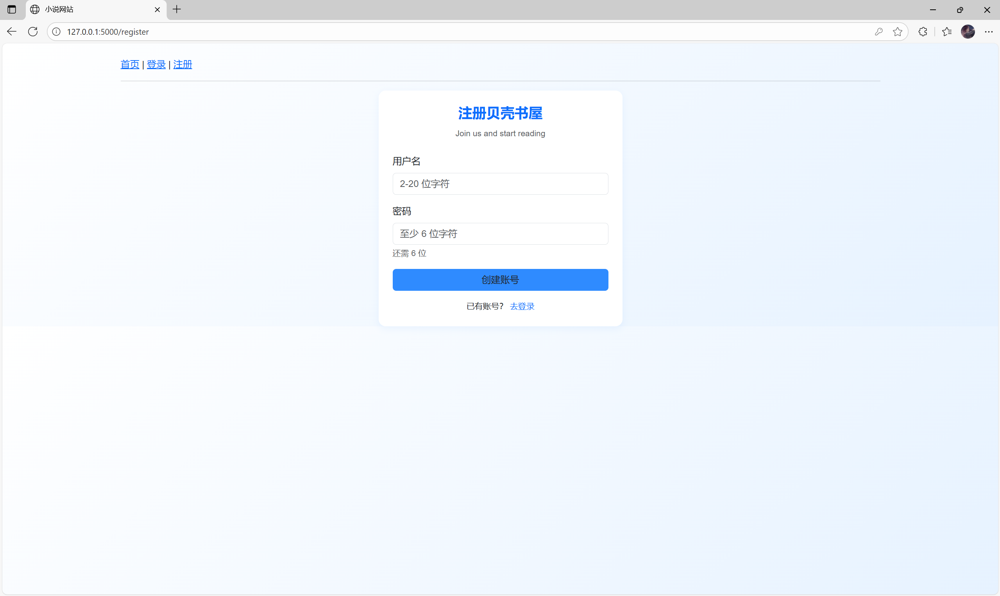
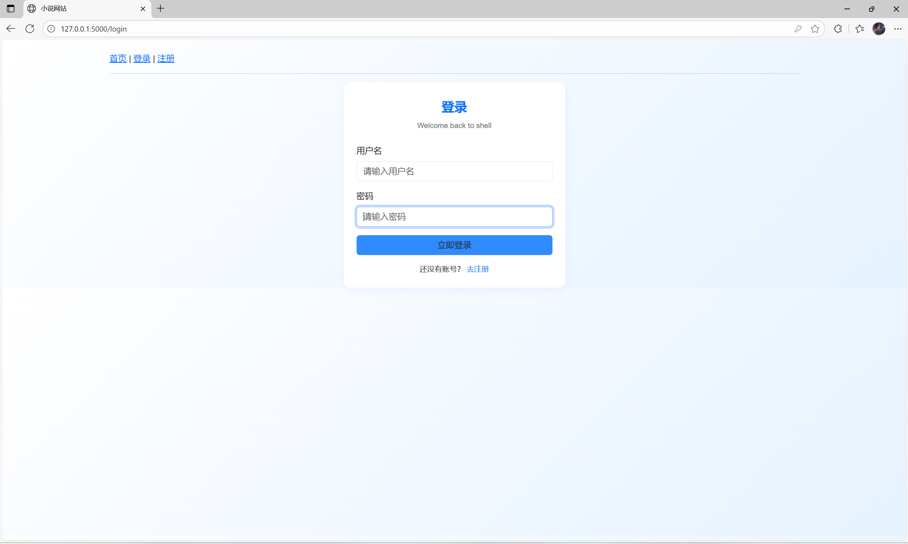
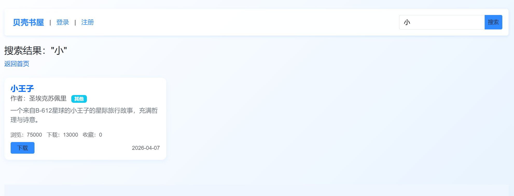
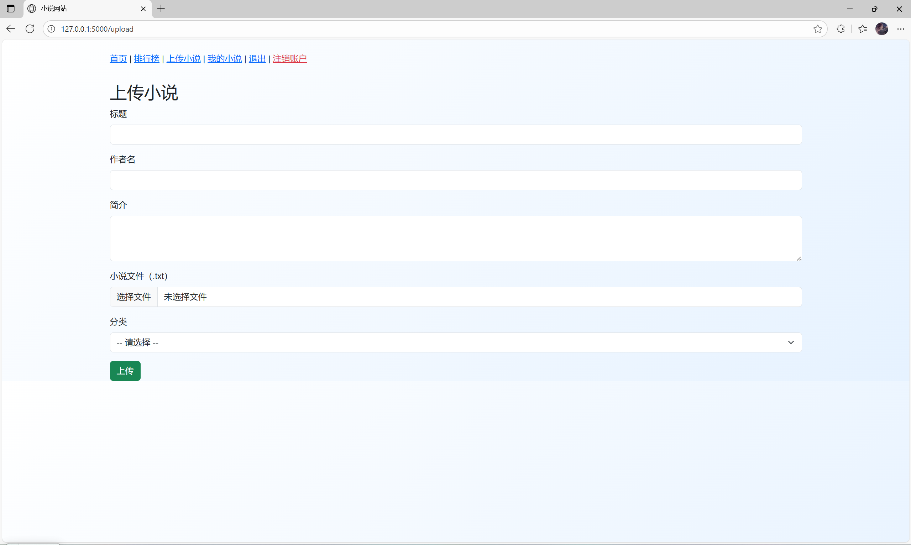
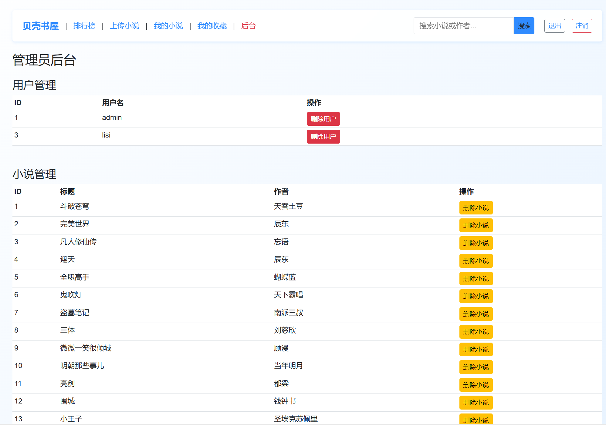

# 项目文档
# 1.项目说明
贝壳书屋 是一款轻量级在线小说分享平台，采用 Flask + MySQL + Bootstrap 5 构建，支持用户注册/登录、上传小说、分类浏览、下载排行、账户注销、管理员后台等功能，界面清爽、部署简单。
## 2. 所需要的环境与组件

主要用到环境：  
Python3.10  
Flask2.3  
PyMySQL  
MySQL  
Flask-Login  
Flask-WTF  
Flask-Migrate
## 3. 安装运行

1. 安装 PyCharm  
2. 用 PyCharm 打开项目根目录  
3. 右下角 Python 3.10 → 新建虚拟环境 → 双击 requirements.txt 自动装包  
4. 修改 config.py 里的数据库/邮箱连接  
5. 运行 run.py，访问地址：http://127.0.0.1:5000  
6. 后台地址：http://127.0.0.1:5000/admin
## 4. 项目效果图

网站首页：

用户注册登录页面：

小说排行、搜索页面：

用户收藏、上传小说页面：

管理员后台页面：

## 5. 说明
个人项目，仅供参考
